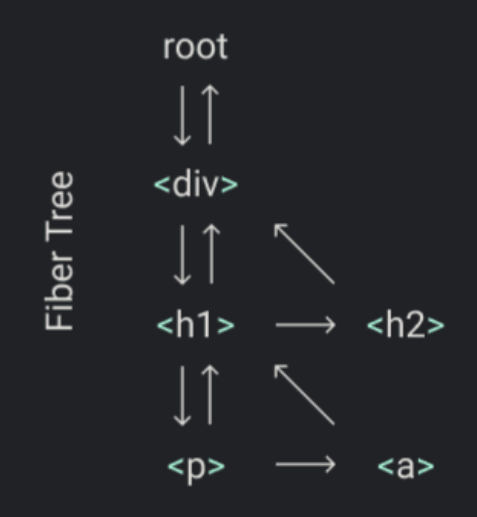

我们需要一种数据结构来组织工作单元：fiber树
每个元素都有一个对应的fiber节点 每个fiber节点都是一个工作单元

假设我们想要渲染下面这样一个元素树：
```js
Didact.render(
  <div>
    <h1>
      <p />
      <a />
    </h1>
    <h2 />
  </div>,
  container
)
```


在**render函数**中 我们将创建**根fiber节点** 并且将它赋值给**nextUnitOfWork**
剩下的工作将在**performUnitOfWork函数**中进行 在这个函数中 我们将对每一个fiber节点做这些事情：
1. 将对应的React元素添加到DOM上
2. 为这个React元素的子元素创建fiber节点
3. 选择下一个工作单元

我们构建fiber树的目的之一就是 很容易地就能找到下一个工作单元 这就是为什么fiber树中，fiber节点会有指针指向其**第一个子节点、下一个兄弟节点、父节点**

如果我们完成了一个fiber节点上的渲染工作 而且它有一个子节点 那么这个子节点会成为下一个工作单元(**赋值给nextUnitOfWork**)
比如上图中 div fiber节点渲染完成之后 下一个工作单元将是h1 fiber节点

如果fiber节点上没有子节点 那么其兄弟节点将成为下一个工作单元
比如上图中 p节点没有子节点 所以p节点渲染完之后 其兄弟节点a节点将成为下一个工作单元

如果fiber节点既没有子节点也没有兄弟节点 其父节点的兄弟节点将成为下一个工作单元
比如上图中的a节点和h2节点

如果这个fiber节点的父节点没有兄弟节点 我们会继续向上遍历其父节点 **直到找到一个有兄弟节点的父节点** 或者**直到回到了根fiber节点**

如果我们返回到了根fiber节点 这意味着我们完成了这次渲染

接下来我们把思路转化为代码

- 首先我们重写render函数
  - 将创建DOM节点的逻辑单独提取出来 我们稍后会用到
  ```js
  function createDOM (fiber) {
    const dom = fiber.type == "TEXT_ELEMENT" ? document.createTextNode("") : document.createElement(fiber.type)
    const isProperty = key => key != "children"
    Object.keys(fiber.props).filter(isProperty).forEach(name=>{
      dom[name] = fiber.props[name]
    })
    return dom
  }
  ```
  - 在render函数中 我们将**nextUnitOfWork赋值给fiber树的根节点**
  ```js
  let nextUnitOfWork = null

  function render(element,container){
    nextUnitOfWork = {
      dom:container,
      props:{
        children:[element],
      },
    }
  }
  ```
- 然后当浏览器空闲的时候（没有高优先级的任务要处理） workLoop函数会被调用 将会从根fiber节点开始渲染
```js
function workLoop(deadline){
  let shouldYield = false
  while(nextUnitOfWork && !shouldYield){
    nextUnitOfWork = performUnitOfWork(nextUnitOfWork)
    shouldYield = deadline.timeRemaining < 1
  }
  requestIdleCallback(workLoop)
}

requestIdleCallback(workLoop)

function performUnitOfWork(fiber){
  // TODO add dom node
  // TODO create new fibers
  // TODO return next unit of work
}
```
- 接下来我们来完成performUnitOfWork函数
  - 首先我们创建一个新的DOM节点并将它放在DOM树中 我们通过fiber.dom属性获取DOM节点
  ```js
  function performUnitOfWork(fiber){
    // TODO add dom node
    if(!fiber.dom){
      fiber.dom = createDOM(fiber)
    }
    if(fiber.parent){
      fiber.parent.dom.appendChild(fiber.dom)
    }
    // TODO create new fibers
    // TODO return next unit of work
  }
  ```
  - 接下来 我们为每一个child创建一个新的fiber
  ```js
  function performUnitOfWork(fiber){
    // TODO add dom node
    if(!fiber.dom){
      fiber.dom = createDOM(fiber)
    }
    if(fiber.parent){
      fiber.parent.dom.appendChild(fiber.dom)
    }
    // TODO create new fibers
    const elements = fiber.props.children
    let index = 0
    let prevSibling = null
    while(index < elements.length){
      const element = elements[index]
      const newFiber = {
        type:element.type,
        props:element.props,
        parent:fiber,
        dom:null,
      }
    }
    // TODO return next unit of work
  }
  ```

  - 然后 我们把它们新建的fiber设置为child或者sibling 第一个是child 其余的是sibling
  ```js
  function performUnitOfWork(fiber){
    // TODO add dom node
    if(!fiber.dom){
      fiber.dom = createDOM(fiber)
    }
    if(fiber.parent){
      fiber.parent.dom.appendChild(fiber.dom)
    }
    // TODO create new fibers
    const elements = fiber.props.children
    let index = 0
    let prevSibling = null
    while(index < elements.length){
      const element = elements[index]
      const newFiber = {
        type:element.type,
        props:element.props,
        parent:fiber,
        dom:null,
      }


      if(index == 0) {
        fiber.child = newFiber
      } else {
        prevSibling.sibling = newFiber
      }
      prevSibling = newFiber
      index++
    }
    // TODO return next unit of work
  }
  ```

  - 最后 我们找到下一个工作单元 先尝试child 没有child就返回sibling 没有sibling就返回uncle节点
  ```js
  function performUnitOfWork(fiber){
    // TODO add dom node
    if(!fiber.dom){
      fiber.dom = createDOM(fiber)
    }
    if(fiber.parent){
      fiber.parent.dom.appendChild(fiber.dom)
    }
    // TODO create new fibers
    const elements = fiber.props.children
    let index = 0
    let prevSibling = null
    while(index < elements.length){
      const element = elements[index]
      const newFiber = {
        type:element.type,
        props:element.props,
        parent:fiber,
        dom:null,
      }
      if(index == 0) {
        fiber.child = newFiber
      } else {
        prevSibling.sibling = newFiber
      }
      prevSibling = newFiber
      index++
    }
    // TODO return next unit of work
    if(fiber.child){
      return fiber.child
    }
    let nextFiber = fiber
    while(nextFiber){
      if(nextFiber.sibling){
        return nextFiber.sibling
      }
      nextFiber = fiber.parent
    }
  }
  ```
  这就是我们的**performUnitOfWork**函数